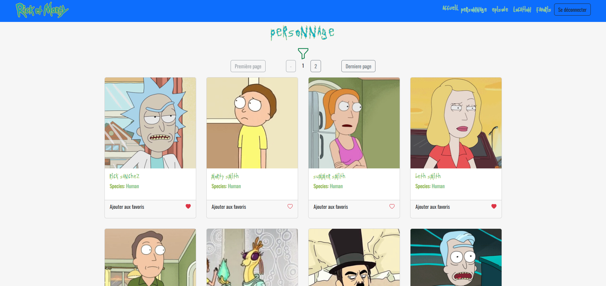

# Rick & Morty Application

## Contexte: 

Vous devez créer une application qui va vous permettre de gérer visuellement les personnages de Rick et Morty.

1 - Quelques contraintes à intégrer au projet, en plus des fonctionnalités présentes dans la vidéo : 

 - Avant d'accéder à l'application, il faut être connecté. On ne pourra accéder à aucune données de l'application sans être au préalable connecté.
 - Pour s'enregister, il faut un username, un email (s'assurer de l'email) et un password (longuer 8, 1 majuscule, 1 minuscule, 1 numérique)
 - 5 components minimums.
 - Il faudra mettre en place un state manager (comme Pinia) pour gérer l'etat global des données dans votre application.
 - Utilisation des slots dans votre projet à votre discretion.
 - Lors du chargement des images lors de la navigation, une image par défaut apparait comme loader, avant l'apparition de l'image.
 - Dans la barre de recherche, on fera la recherche par nom du personnage.
 - On peut cumuler les critères du filtre.

 2 - Les données dont vous pourriez avoir besoin : 

 - URL à appeler : https://rickandmortyapi.com/api/character/  (appel api avec axios ou fetch)
 - Les images sont présentes dans le dossier sur Teams.
 - URL : Documentation de l'api => https://rickandmortyapi.com/documentation

3 - step 3 : Gestion des episodes.

 - Afficher la liste des episodes avec les informations concernant cet episode.
 - Pour chaque episode, il faudra faire en sorte en plus des informations de l'episode, afficher les personnages de l'episode sous forme de photo avec son nom.
 - Lorsque je clique sur une photo d'un des personnages d'un episode, une modale apparait avec les informations du personnage.
 - Vous pouvez afficher les episodes sour la forme que vous souhaitez. Privillégier une card, si vous le souhaitez.
 - L'affichage de l'information doit être qualitative, bien structurée et avec un UX/UI qualitatif.
 - Vous pouvez naviguer vers cette page avec un onglet dédié dans la barre de menu.
 - Vous ne pouvez toujours pas accéder à cette page si vous n'êtes pas connecté à l'application.
 - Dédié un store pour ce niveau de donnée.

4 - step 4 : Gestion des locations.

 - Même contrainte que pour la gestion des episodes mais pour les locations.
 - Format de card un peu différent pour les locations.

5 -  step 5 : Gestion des favoris.

 - Vous allez pouvoir selectionner des favoris dans votre liste de personnage.
 - Une vue sera dédiée à stocker ces favoris sous forme de tableau.
 - Vous pouvez naviguer vers cette page avec un onglet dédié dans la barre de menu.
 - Les personnages favoris auront un coeur rouge dans la card sinon blanc.

## Résultats
- Page d'accueil

- Page des personnages

- Page des localisations

- Page des favoris

